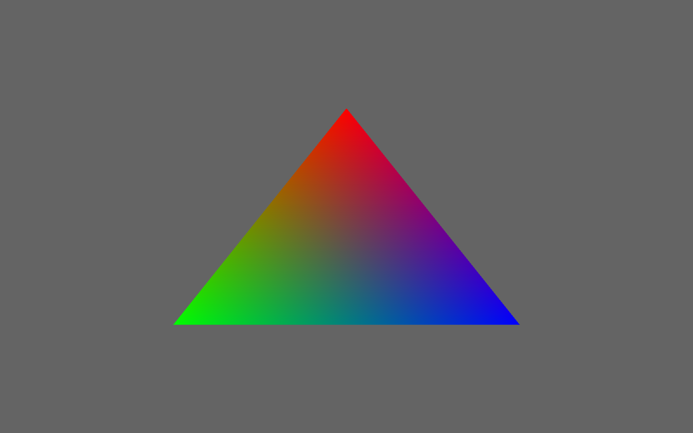
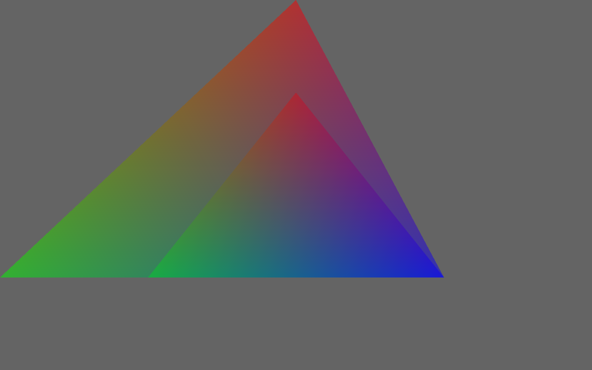
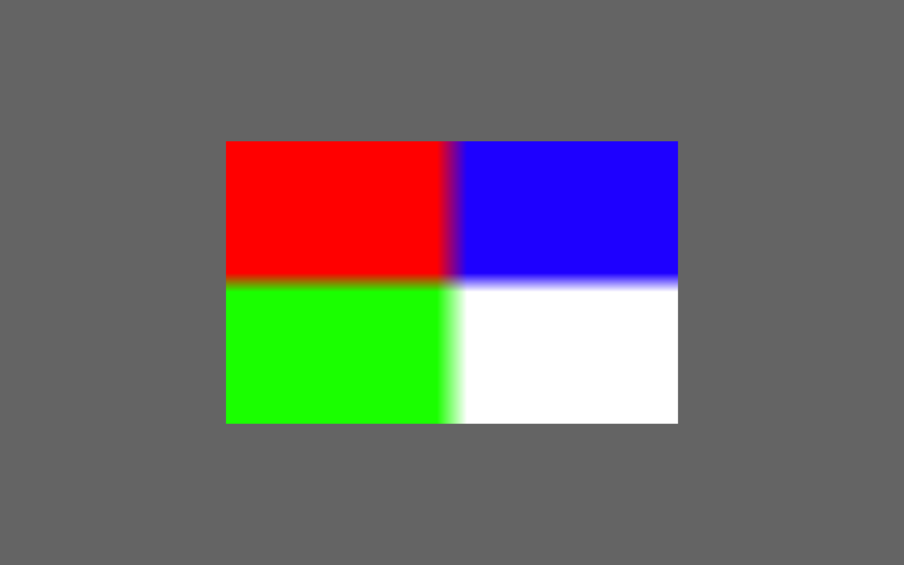
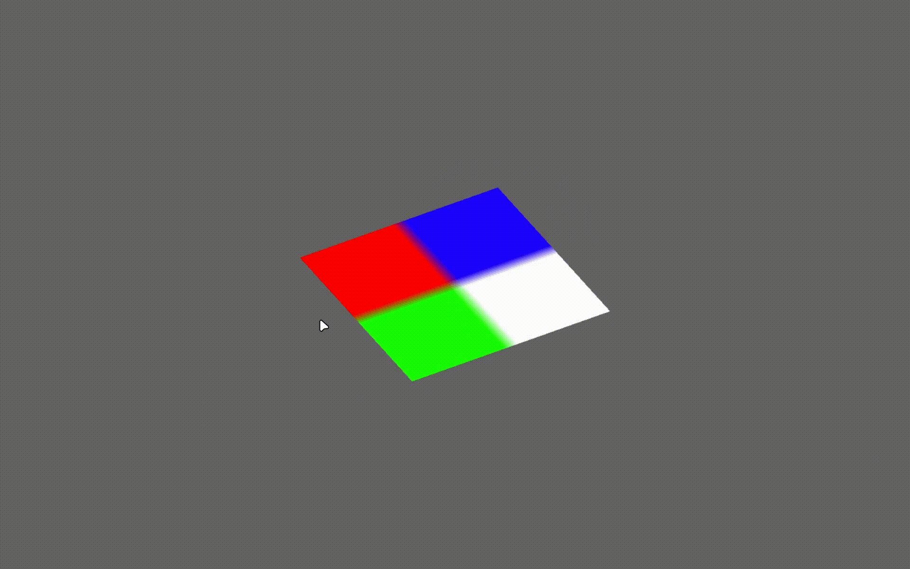

[](https://github.com/arkin99-p/PixelForge/actions/workflows/build.yml)
[](https://opensource.org/licenses/MIT)
[](https://isocpp.org/)

# PixelForge

**PixelForge** - my educational software graphics pipeline in C++ on CPU.
I created this project to improve my understanding of the graphics pipeline.

In it, I implemented a fully functional graphics pipeline featuring vertex and fragment shaders, all the necessary mathematics, and texture loading via stbi.

## Screenshots


*This is base triangle render from "Quick Start"*


*This is transparent triangles render. There are two triangles with 50% transparent.*


*This is textured square render. Used textures is "resources/square.png"*


*This is rotated square render. Used textures is "resources/square.png" and rotated it.*


*This is example of use my graphic API for create 3D-scene.*

## Current Features

- **Textures** - Loading and applying textures using stb_image
- **Z-buffer** - Full 3D graphics support
- **Alpha-blending** - Alpha channel (opacity) support
- **SIMD** - SSE/AVX-optimizations
- **Shaders** - Creating a vertex and fragment shader
- **Math** - Vectors, Matrices, Quaternion

## Dependencies

- **CMake** 3.15 or later
- **C++ compiler** with C++20 support (GCC 10+, Clang 12+, MSVC 2019+)
- **SDL3** (Simple DirectMedia Layer 3)
- **stb_image**

## Build and Run

#### 1) Clone the repository:
```bash
git clone https://github.com/arkin99-p/PixelForge.git
cd PixelForge
```

#### 2) Configure and build with CMake:
```bash
mkdir build && cd build
cmake ..
cmake --build . --config Release
```

#### 3) Running examples:
```bash
# Minimal triangle
./examples/minimal/PixelForge_minimal

# Transparent triangle
./examples/transparent/PixelForge_transparent

# Textured square
./examples/textured/PixelForge_textured

# Rotating textured square
./examples/rotated/PixelForge_rotated

# Full demo with camera, transparency and quaternion rotation
./examples/demo/PixelForge_demo
```
*Note: The rotated and demo examples use a texture from resources/square.png. CMake copies this file to the build folder automatically. If you see a blank screen, check that build/resources/square.png exists.*

## Quick Start

```cpp
#include "pixel_forge.hpp"
#include "math.hpp"

static float verts[] = {
         0.0,  0.5, 0,   1,0,0,
        -0.5, -0.5, 0,   0,1,0,
         0.5, -0.5, 0,   0,0,1
};

class Win : public PixelForge {
protected:
    void load() override {
        setOpaqueRender(true);
        setVertexShader(vertexShader);
        setFragmentShader(fragmentShader);

        layout.addAttribute(AttributeType::Position, 3);
        layout.addAttribute(AttributeType::Color, 3);
    }
    void render() override {
        fillColor(100, 100, 100, 255);
        clearZBuffer();

        drawTriangles(verts, 3, layout);
    }
    void resize() override {
        XY start{ 0, 0 };
        XY end{ getWidth(), getHeight() };
        setViewport(start, end);
    }
private:
    static VertexBufferLayout layout;
    static VertexOutput vertexShader(const VertexInput& in, std::unordered_map<std::string, Uniform>& uniforms) {
        VertexOutput out;
        out.position = in.position;
        out.color = in.color;
        return out;
    }
    static Vector4 fragmentShader(const FragmentInput& in, std::unordered_map<std::string, Uniform>& uniforms) {
        return in.color;
    }
};

VertexBufferLayout Win::layout;

int main() {
    Win app;

    if (app.init("Test", 500, 500, SDL_WINDOW_RESIZABLE))
        app.run();

	return 0;
}
```

## Project Structure

```
PixelForge/
├── src
│   └── pixelforge
│       ├── math.hpp
│       ├── math.cpp
│       ├── pixel_forge.hpp
│       ├── pixel_forge.cpp
│       ├── texture.hpp
│       ├── texture.cpp
│       └── CMakeLists.txt
├── examples
│   ├── minimal
│   │    ├── main.cpp
│   │    └── CMakeLists.txt
│   ├── transparent
│   │    ├── main.cpp
│   │    └── CMakeLists.txt
│   ├── textured
│   │    ├── main.cpp
│   │    └── CMakeLists.txt
│   ├── rotated
│   │    ├── main.cpp
│   │    └── CMakeLists.txt
│   ├── demo
│   │    ├── main.cpp
│   │    ├── window.hpp
│   │    ├── window.cpp
│   │    └── CMakeLists.txt
│   └── CMakeLists.txt
├── resources
│   └── square.png
├── LICENSE.txt
├── CMakeLists.txt
├── README.md
├── ROADMAP.md
├── screenshots
    ├── base_triangle.png
    ├── textured_square.png
    ├── transparent_triangle.png
    ├── rotated_square.gif
    └── demo.gif
```

## Third-party libraries

- **SDL3** – zlib/libpng license, [link](https://github.com/libsdl-org/SDL)
- **stb_image** – public domain / MIT, [link](https://github.com/nothings/stb)

## Roadmap
*For planned features and future improvements, see the [Project Roadmap](ROADMAP.md).*